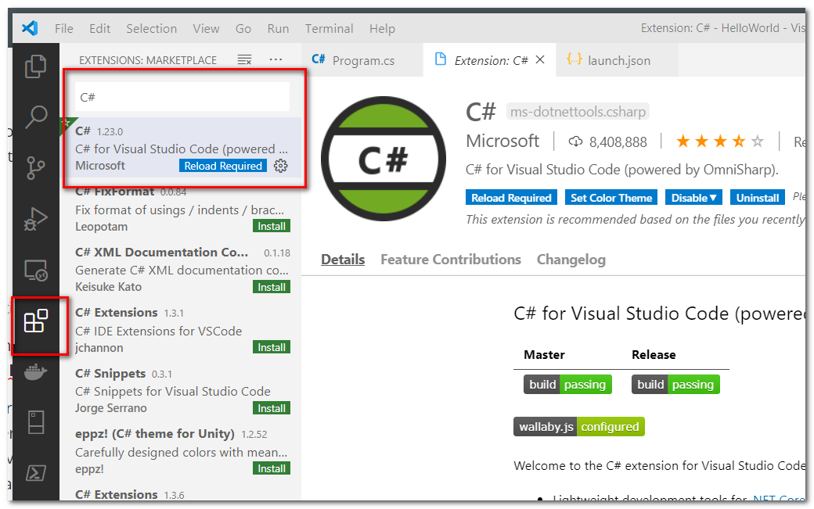
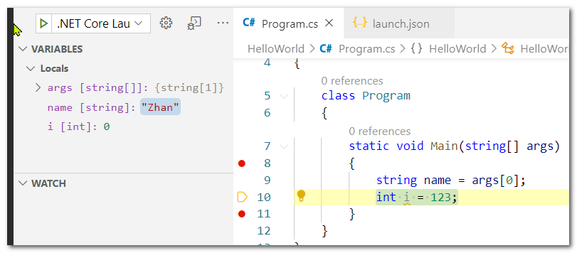

# Programming Bootcamp 

> This article is is NOT a systematic programming course, but a boot start for initial setup and a taste of things you will encounter during your learning.  

> I recommend C# courses online like this one https://app.pluralsight.com/library/courses/csharp-fundamentals-dev/table-of-contents


## Why C#/dotnet?

* C# is the main language we use in Rave and Ravegarage.
*  DotNet is a programming platform that's modern and popular, you can write dotnet program with many languages, the most popular is C#
* DotNetCore is the dotnet version aiming cross platform. Ravegarage is rewritten in dotnet core and can be executed from Mac.


## What tools do I need

* [DotNetCore sdk](https://dotnet.microsoft.com/download/dotnet-core/3.1) provides tools to compile and execute your program

* [Visual Studio Code](https://code.visualstudio.com/download) is a free code editor on both Windows and Mac

  >  VS Code does not support C#/.NET out of box, you need to download the extensions. Fortunately this process is very easy.
* [Visual Studio](https://visualstudio.microsoft.com/downloads/) has free (Community) version too, .Net core/C# is natively supported and the debugging experience is better than VS code, one important feature is that I can modify code during debug and without to restart and recompile the whole project.


## Terminologies

> These are just my descriptions for you to grasp the idea, they may not be very accurate definitions.

* **Assembly file** is the compiled from your source code, and can be executed (on Windows it's ***.exe **) or invoked by other execution assembly (***.dll**)

* **Project** is source code organization unit where you can put many related source code files together, and compile into exe or dll file. A project can reference to other projects( or its compiled counterparts, dll files). That is why we can use other people's works and not starting everything from scratch.  
  For example, in Ravegarage we use Selenium Web Driver (in form or dll file, download as nuget package) and use different browsers without knowing how the details work to communicate to a browser.
* **Solution** is the upper folder that contains your many projects. 
  * In visual studio, there is a solution file *.sln to organized projects together
  * In VS Code, just putting projects folder under solution folder is enough
* **Nuget** is package system used in .NET world to search and download assemblies from other people. We will use it to download selenium web driver in  VS Code in this article


## Setting up VS Code

After you install and open VS Code, 

* Click extension icon, search for `C#`, click install




* Then search and install `NuGet Gallery`
* Then maybe `Cucumber (Gherkin) Full Support`, it helps to colorize and reformat the feature file 


## Hello World project

Anywhere in your computer, create a HelloWorld folder. Open a command line in HelloWorld, and type

```
dotnet new console -n HelloWorld
```

* You are using the `dotnet` tool installed by DotNetSDK
* You are telling it to create a new **console** project , here console  is one of the many preinstalled templates come with the SDK. Try just type `dotnet new ` to see other templates you have.   A console compiles into exe file (on windows) and when you  open it, it shows a console window and exchange information by text.
* You are giving the project name by `-n HelloWorld`


Now you should have HelloWorld solution folder that you created manually, in have another HelloWorld project folder created by the command. Inside, you have the `Program.cs` 


You can open the otter HelloWorld folder in VS Code, press F5, now VS asks you what debug configuration, you select **.Net Core**


By default the program prints out `Hello World!` among other outputs , though in different color. To let the program open a separate window, click the `launch.json`


Remove the original text after `console`, and type `"externalTermial"`


Now press `F5`, you will see a console window starts and closes immediately, that's because by default when the program is done the window will close. There are many ways to let the window stay, one of them is to add `Console.ReadLine()` at the end which waits for use to enter a line(by Enter key).


```C#
static void Main(string[] args)
{
    Console.WriteLine("Hello World!");
    Console.ReadLine();
}
```


Now the window will stay.


## A bit explanation

Here is the code it generates in console template

```C#
using System;

namespace HelloWorld
{
    class Program
    {
        static void Main(string[] args)
        {
            Console.WriteLine("Hello World!");
        }
    }
}
```


Let's start with `Console.WriteLine("Hello World!");` You are using a  `Console.WriteLine`.  That `Console` class sits inside `System` namespace (so its full name is `System.Console`). A namespace is a way to organize classes and reduce chance of conflict.

If you and I both write a class called Cat,  then we you say `Cat`, whose version of Cat are you referring to?  If we could put our `Cat` in different namespaces (yours is PetSalon.Cat, mine is Zhan.CityZoo.Cat), it will be easier to refer. 

We could type out the full name `System.Console'` whenever we use it or, for lazy people, we put `using System;` on top of file and just use `Console` later.


Now let's look at the method 

```C#
 static void Main(string[] args)
```


HelloWorld project is console project which will be compile into exe file (on windows) and when people run the exe, the program needs to start somewhere. This `Main` method provides the entry point by convention.

In C# a method can not exists by its own, it has to sit in a `class` . A class plays very important role in OOP (object oriented programming), however here it along with the namespace just provides a place for Main method to sit in.


## More ways input

Now your program prints a line in console window. It's time to learn ways to feed the program.

* Use `Console.ReadLine();`

```C#
Console.WriteLine("What's your name?");       
string name = Console.ReadLine();
Console.WriteLine("Hello " + name);
```

Now the program prints out a question first.

Then the middle line defines a `string` type variable called `name`, and use the value get from `Console.ReadLine();` to put in it.

Then it prints out Hello plus the name user enters.  A `+` sign concatenates 2 strings together in C#


*  Use program arguments

The ` Main(string[] args)` methods accepts an array of string passed in as program arguments. `string[]` means string array.

It can be empty, you can use `args.Count` to see how many strings are in there.

You can use args[0] to get the first string from the array, in C# the index starts with 0 instead of 1. But you'd better check count first because if you call `args[0]` while args has no items, there will be `Exception` ( a way that can cause the program  to exit abruptly)

```C#
static void Main(string[] args)
{
    string name = "Default Name";
    if(args.Length > 0)
    name = args[0];

    Console.WriteLine("Hello " + args[0]);
    Console.ReadLine();
}
```

If you run now, you will see **Hello Default Name**

To provide arguments in debug mode in VS Code, go to `launch.json`, put a string after `"args" :`


Now if you run, expect to see **Hello Zhan**


For end users, they are going to use the exe file compile in `HelloWorld\HelloWorld\bin\Debug\netcoreapp3.1` default. They just need to add strings after exe file name in command line.

```bash
C:\Desktop\HelloWorld\HelloWorld\bin\Debug\netcoreapp3.1>HelloWorld.exe Jim
Hello Jim
```

If there are spaces in the string, you need to put it in double quotes

```C#
C:\Desktop\HelloWorld\HelloWorld\bin\Debug\netcoreapp3.1>HelloWorld.exe "Jim Carrey"
Hello Jim Carrey
```


* Input from text file

You can also read file in C#,

`C:\test.txt`

```
you read my heart
```

`Program.cs`

```C#
var text = System.IO.File.ReadAllText("c:\\test.txt");
Console.WriteLine("file context is " + text);
Console.ReadLine();
```

Note the path in code has double back slashes `\\`, that is because `\` in C# string has special meaning (escape character )


## Debug

We programmers learn from mistakes, and we get to the heart of our mistakes by debug. 

Put a breakpoint at beginning of Main method by clicking on left side of the line number.


Then `F5`


You will see instead of executing to the end, the program freezes at line 8, also you can observe the variables' value in the **Variables** window. At this moment,

* string array `args[]` has 1 item `"Zhan" ` in it. 
* `name` will be assigned from args[0], however since this has not happened yet, `name` holds special value `null` which means there is nothing yet.
* integer variable `i` gets its value from constant 123, however that has not happened either, for numbers, the default value is 0 instead of `null`.


Now press `F10` twice, it means  proceed to next step (2 times) 




You will see name gets its value `"Zhan"`, however `i` is still `0`.

To continue to execute to end, press `F5`


> It's nice to freeze the moment and see all the values and follow the logic step by step. However the debug experience in Visual Studio 2019 is even better, there you can not only observe, but to change the value and rewind time by dragging the current line pointer(yellow icon) to any previous or future line.


## A taste of algorithm 

To do a thing in steps, the steps can happen sequentially or contain some loop or can only happen in certain condition. That's all it is for basic algorithm.

To put an elephant in fridge, here are the steps:

*  Cut the elephant in chunks that can fit (array)
* Open fridge door
* Loop though all chunks and put them in
* If fridge in full, close fridge door and get another one
* Repeat previous 3 steps until no more chunks outside.
* Close the last fridge's door


**If statement**

```C#
if(true){
    //everthing happens here will always happen, making the if check useless
}

bool ifFull = false; //give its initial value
//ifFull can be set again according user input or other sources
if(ifFull){
    //this is more useful because there is not way to know ifFull is True or False at compile time.
}
```


**For-loop**

```C#
//for loop
for (int i = 0; i < 10; i++)
{
    Console.WriteLine("Current is on " + i);
}

```

Output

```
Current is on 0
Current is on 1
Current is on 2
Current is on 3
Current is on 4
Current is on 5
Current is on 6
Current is on 7
Current is on 8
Current is on 9

```


The `for (int i = 0; i < 10; i++)` means loop the following code x times

Think of it as `for(part1; part2; part3)`, `part1` gets executed once to set initial value, `part2` executes before each loop to evaluate a bool value (true or false), if it's true, then go ahead execute the body (in curly braces), otherwise exit for-loop. `part3` executes after each loop body.

* first time `i=0` then check if `i<10`,  because 0<10 is true the program continues to print out `Current is on 0`
* then at the end of first loop, `i++` is equivalent to `i=i+1` , now `i` holds 1
* Then check 1<10? Because it's true, prints out `Current is on 1`
* This loops continues till it prints out `Current is on 9`, then `i++` makes `i` to hold 10
* Then the check `i<10` is false (10 is not less than 10) , now the for loop exits 


Phew! If you never touched any programming language before, it will take a while to sink in. However, for-loop is at the core of any programming language, you will get used to it .

Also a good editor like VS Code or VS2019 comes with code snippets , you just type `for` then select or tab out, it will print out the scaffold for you. 


```C#
//just type "for", then press Tab, you will get:
    
for (int i = 0; i < length; i++)
{

}
```


> There are other flow controls that beyond the content of this article.


 **Exercise 1, print any number of stars in a row**

> Note Console.WriteLine() prints out new empty line
>
> Console.WriteLine("*")  prints a start and ends with new line
>
> Console.Write("*") prints out a start and stays at same line 

```
Print this:
***********************
```


You could use 

```C#
Console.WriteLine("***********************");
```

But it doesn't stretch well when you want to print different number for starts, or when I need 10023 stars, it's just hard to count.

The right way is :

```C#
//replace 20 with any number

for (int i = 0; i < 20 ; i++)
{
	Console.Write("*");
}
```

The number could also come from user input

```C#
//We assume args has at least 1 string item, and it's a number
//then use int.Parse() method to convert it to a real integer.

int num = int.Parse(args[0]);
for (int i = 0; i < num ; i++)
{
	Console.Write("*");
}
```


 **Exercise 2, print  triangle of stars**

```
Print this:
*
**
***
****
*****
******
*******
********
*********
```


**Answer**:

```C#
for (int line = 1; line < 10; line++)
{
    for (int i = 0; i < line ; i++)
    {
        Console.Write("*");
    }
    Console.WriteLine();
}
```


There is a nested for-loop. Each outside loop prints a new line and each inner loops prints some stars, the number of stars is the line number itself.


 **Exercise 3, print Christmas tree shape **

```
Print this:
         *
        ***
       *****
      *******
     *********
    ***********
   *************
  ***************
 *****************
```

> Hint: pint the stars increase by 2 per line first, then try to insert spaces from left.


## A taste of OOP

To be edited......


## Using NuGet to get WebDriver

Remember in `Setting up VS Code` section we installed `Nuget Gallery`? 

Now go to `View > Command Palette` menu (or Ctrl+Shift+P) , search and select `Open Nuget Galley`


It will bring up a **Nuget Gallery** tab.

Search for` selenium`, select the `Selenium.WebDriver`, check `HelloWorld.csproj` and click `Install`


Also select the `Selenium.WebDriver.ChromeDriver` and click `Install`


Now go back to `Program.cs` tab

Type 

```C#
var driver = new ChromeDriver()
```

`var` means declare a variable and deduce its type from the right side of `=` 

In this case `new ChromeDriver()` creates an instance of `ChromeDriver` type, so we don't have to type it out on the left side as variable type again, although we could still do it:

```C#
ChromeDriver driver = new ChromeDriver()
```


Remember the `using System;` at the first line of the file? It's because the `Console` class we use later exists under that **System namespace**. Same thing here, `ChromeDriver` exists  in some namespace, you either use the full name `SomeNamespace.ChromeDriver` or type a using `SomeNamespace` at top of file.

But what namespace is `ChromeDriver` sitting inside? Without a good editor like VS Code, the only way is to check the documents online.

However in VS code, you can "discover" and fix the issue by placing cursor on `ChromeDriver`, then a yellow light bulb icon shows up, clicking it, you can choose to add the correct "using" statement.


Now , add some steps to navigate to google page, the class looks like this:

```C#
using System;
using OpenQA.Selenium.Chrome;

namespace HelloWorld
{
    class Program
    {
        static void Main(string[] args)
        {
            var driver = new ChromeDriver();
                
            
            
            Console.WriteLine("Press enter to exit");
            Console.ReadLine();
        }
    }
}
```


With the driver object created, it will launch a new Chrome window (make sure your Chrome is up to date, the driver you downlead from nuget usually have a minimum Chrome version requirement), you can call its method to Navigate to an URL, read values from page, and set new value (type in text box etc.)


Before adding more code, we need to execute the code, let it open google, and observe.

* Press F12 to bring the developer tools in Chrome,
* Press Inspect tool icon
* Hover over the search textbox, you can see it's a textbox with `name="q" `. We will use it as a way to identify the textbox.
* The same way we find that the search button has `name="btnK"`


```C#
using System;
using OpenQA.Selenium;
using OpenQA.Selenium.Chrome;

namespace HelloWorld
{
    class Program
    {
        static void Main(string[] args)
        {
            //open browser
            var driver = new ChromeDriver();
            
            //navigate to URL
            driver.Navigate().GoToUrl("http://www.google.com");
            
            //find and send text to keyword box
            var keywodTxt = driver.FindElementByName("q");
            keywodTxt.SendKeys("ni hao");
            
            //wait for half a second, this is not the best way to do it however it's simple
            System.Threading.Thread.Sleep(500);
            
            //click search button
            driver.FindElementByName("btnK").Click();

            //wait for Enter so program does not exit immediately 
            Console.WriteLine("Press enter to exit");
            Console.ReadLine();
        }
    }
}

```


## End 

It's the end of this bootcamp but beginning of a new journey.